# BandofFluffy

视频链接：[https://sidequestvr.com/app/26456/animal-dash](https://sidequestvr.com/app/26456/animal-dash)

## 基础架构

## 渲染

### 渲染系统

#### 光照

每一个关卡都只采用一盏动态光（动态光对VR性能影响很大，每多一盏都可以看得出来）和少许几盏静态光作补光所有静态光都自定义了MaxDrawDistance与MaxDistanceFadeRange。

#### 视效

使用Niagara System制作一些简单特效给予玩家游戏状态的提示。

#### 后处理

采用MSAA*4抗锯齿，考虑过FSAA的但是实际测试出来FSAA却差一点，之前有看到UE对VR的MSAA算法有优化，可能是因为这个吧。

#### 基于物理渲染

基于物理的渲染(Physically based rendering)(PBR)意味着表面接近光线在真实世界的表现方式，而不是我们直观以为的应有方式。相较于完全依赖美术师直觉来设置参数的着色工作流程，遵守PBR原则的材质更准确，并且通常看起来更自然。不过由于游戏风格影响仅少部分是基于物理的渲染例如附有青苔的石头等。

#### 大气雾效

你可能会有这种情况：`on mobile the SkyAtmosphere component needs a mesh with a material tagged as lsSky and using the SkyAtmosphere nodes to visualize the Atmosphere.`那么问题很明显，你当前使用的SkyAtmosphere需要做一点改动，[原文](https://forums.unrealengine.com/t/help-completely-lost-with-the-message-on-mobile-skyatmosphere-needs-a-mesh-tagged-issky/252845/11)：Go to the outliner and select your SkyAtmosphere. In the details, choose “SkyAtmosphere (Instance)”, click “Add”, and add a Static Mesh. Click your new mesh, go to the Static Mesh property, and change it for SM_SkySphere. Click your new mesh, go to the Materials property, and where it says Element_0, change in the dropdown for SkySphereMaterial. In your content browser, go to All/Engine/Content/EditorMaterials/Thumbnails and open SkySphere Material.

In SkySphereMaterial, follow the comment

1. In Details->Material->Blend Mode, Opaque不用改
2. In Details->Material->Shading Model, default Lit -> Unlit
3. In Details->Material (Advanced)->Is Sky, tick the box to mark as True

但是，其实直接用BP_Sky_Sphere就行，不用作上面操作，这个警告就会消失

另外由于性能问题将大气雾效的参数拉的很低，然后在远处放置一个倾斜的大面片做一个假的云雾特效。

### 优化

比较详细的在另一篇文章：[https://windcrazy123.github.io/2021/04/18/%E4%BC%98%E5%8C%96](https://windcrazy123.github.io/2021/04/18/%E4%BC%98%E5%8C%96)

## 动画

### 角色动画

#### 事件图表

初始化角色变量和物理模拟组件变量之后有用，每帧更新玩家运动状态和物理模拟所需要的参数如：开启物理模拟后的四个骨骼location和一个rotation

#### 动画图表

基础走跑跳蹲爬state与物理模拟state相互转换，转换条件是：是否进行物理模拟且是否死亡，死亡时客户端在动画蓝图中同步骨骼位置与旋转，由于设置了物理资产中的物理动画的参数，因此在本地模拟物理的同时还会去跟动画蓝图中的Location和Rotation靠近，之后判断是否恢复，如果是，则动画从当前物理模拟保存的姿势开始播放起身蒙太奇动画

## 物理

### 角色触发Ragdoll逻辑

继承接口，当障碍物造成伤害时会对角色调用事件接口，过高跌落会触发重伤逻辑接口；之后根据不同程度伤害触发不同声音并改变角色的最大移动速度，调用不同的布娃娃响应事件

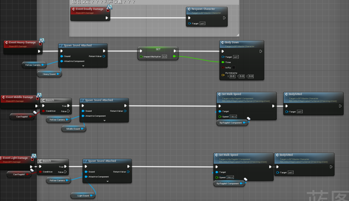

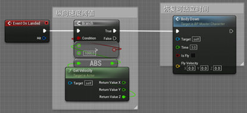

#### 布娃娃轻中伤害

调用bp_ragdoll_component组件中的接口，并设置physical animation偏向动画的权重，同时设置定时器计时结束则从布娃娃状态中恢复

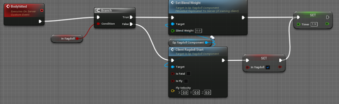

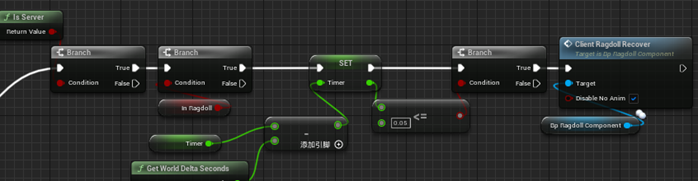

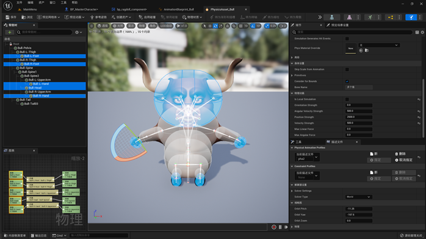

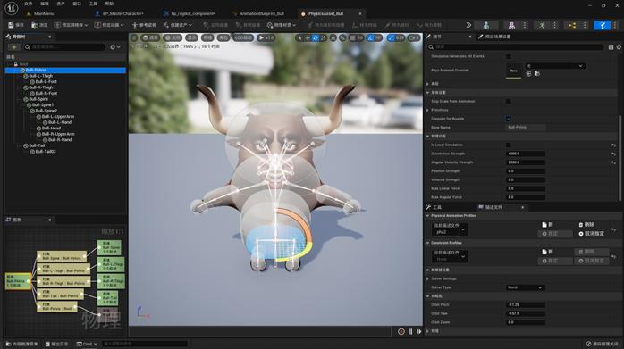

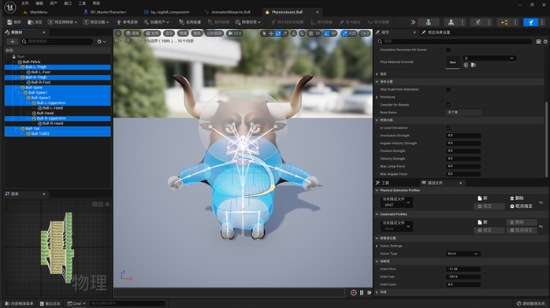

#### 重伤/死亡

向服务器发送请求更改physicalanimation profile配置，调用bp_ragdoll_component组件中的接口开始执行布娃娃，并在一定时间后组播起身布尔值使之可以向服务器发送起身命令

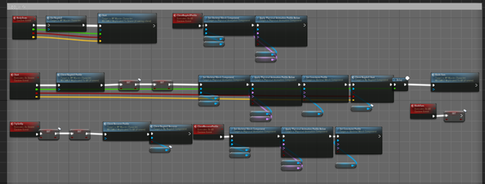

在重伤时同步布娃娃中胶囊体的位置

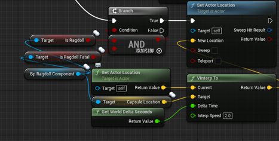

服务器和客户端都模拟物理，但数据传输是每秒五次进行骨骼位置的复制

### 物理模拟组件

>参考：[Mutiplayer Ragdoll](https://www.unrealengine.com/marketplace/profile/Master+Dinochan)

组件初始化：

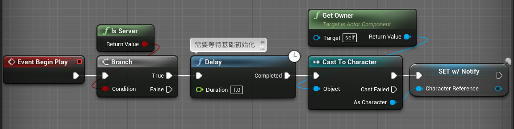

Notify初始化CharacterMesh(Replicated)

公开暴露方法：

回调方法：

主要逻辑：一个是开始物理模拟另一个是结束物理模拟

开始物理模拟：保存当前速度和胶囊体位置停止蒙太奇动画使胶囊体无碰撞设置MovementMode==NONE，所有客户端和主机开始模拟物理，使用之前保留的速度设为当前物理速度作为抛射速度。轻重伤和主机与客户端的逻辑有区别，具体根据项目配置改变即可

tick：更新胶囊体位置和Character的Rotation与Location还有骨骼的四个Location一个Rotation（复制）轻重伤和主机与客户端的逻辑有区别，具体根据项目配置改变即可

退出物理模拟：恢复时则保存当前pose停止蒙太奇启用胶囊体碰撞，播放起身蒙太奇动画，结束后发起通知并停止tick，轻重伤和主机与客户端的逻辑有区别，具体根据项目配置改变即可

在人物蓝图中响应通知事件，停止物理模拟

> 较详细的有：[物理模拟](https://windcrazy123.github.io/2021/04/18/%E7%89%A9%E7%90%86%E6%A8%A1%E6%8B%9F/)
>
> ​					  [杂记-物理](https://windcrazy123.github.io/2021/04/18/%E5%AD%A6%E4%B9%A0%E7%AC%94%E8%AE%B0%E6%9D%82/#%E7%89%A9%E7%90%86)

## 音效

脚步声添加动画事件响应发射射线检测地面的物理材质，根据物理材质发出不同的声音，障碍物撞角色时发出的声音进行多播，但BGM，淘汰声音不进行多播，且为2d音效不是前面的双耳音频空间化，和音效衰减。

## GamePlay

### AI

> 这里有一篇入门的：[UE 行为树基础](https://windcrazy123.github.io/2021/08/20/AIBasic/)

检测是否有玩家在前方或后方，如果在前方则尽力追逐并制造混乱使之进入布娃娃状态，如果在后方则有可能去赌玩家的路，如果离玩家较近则有可能撞击玩家，最高指令是翻越障碍抵达终点，抵达终点后则会来回游荡。

### 角色结构

主体使用父类写共有逻辑，VR添加左右手控制器添加两个相机用于第三人称第一人称切换，两个碰撞球用于获取控制器速度，right widget interaction用于UI交互，并与Left Arrow获取控制器方向

### 角色运动逻辑

#### 移动

每帧判断控制器是否按下，获取当前VR控制器速度根据此速度更新角色位置并移动（既双手摆臂），同时计算卡路里

卡路里算式： 

参考条件：68公斤、乒乓球运动1分钟卡路里为5000卡，1分钟同侧摆臂180次（往返计为1次）3次/秒

参数计算：单次摆臂消耗卡路里A=5000卡/2(双臂)/180次=0.01388889千卡/次

环境设定：设定一次摆臂 往返位移B=60*2cm

每秒消耗卡路里X=每秒摆臂次数Y*单次摆臂消耗A*2双臂

每秒摆臂次数Y=1/(往返位移B /摆臂速度V)  V来自于蓝图计算结果来自于当前帧的取值（手柄摆动速度）

每秒消耗卡路里X=1/(往返位移B /摆臂速度V) *单次摆臂消耗A*2双臂

累积消耗卡路里X按秒累加

推动摇杆会获得一半的正常移动速度

#### 跳跃

每帧判断控制器运动状态是否可以跳跃，同时有判断是否可调用布娃娃跌倒起身事件

#### 翻滚

每帧判断控制器是否相对，控制器移动速度是否大于阈值，再进行蒙太奇动画（同步）

通知所有人播放蒙太奇动画，同步碰撞体半高，设置碰撞体和mesh相对位置使人物保持在地面

通知拥有客户端可以再次使用翻滚动作

### 角色视角控制

手柄摇杆推动大于一定阈值时可以进行正常的视角旋转

手柄朝向位于控制器左右时也会调用yaw input事件

第一人称，第三人称的转换：触发转换视角事件改变摄像机激活状态和UI的状态

### 障碍物

继承于DamageActor-lbd，他们都会调用对应的人物伤害接口

#### 关卡1：

滚筒：设置定时器每0.7秒发射滚筒每个滚筒存在7秒

稻草人：第一个玩家进入触发逻辑，稻草人开始左右移动，最后一个玩家出来时，结束循环

死亡平面：Overlap触发死亡事件

左右雪球：设置两个定时器都是每秒发射一个雪球每个雪球存活8秒

石头-Robin：初始化中获得向上和向下移动总时间，玩家进入范围随机时间下降上升，每帧tick使石头上升下降

藤条：暂停随机时间后使藤条前后摆动

#### 关卡2：

石头：设置定时器随机时间发射石头，每个石头存活4秒

门：不断开关门

花盆：随机时间发射花盆，每个花盆存活4秒

油漆桶：随机发射油漆桶，每个存活4秒

架子：施加冲量模拟物理

纸团：随机发射，每个存活3秒

松果：第一个玩家进入触发逻辑，松果开始左右横跳，最后一个玩家出来时，结束循环（）

滚石：两个碰撞盒，都会触发随机定时器发射滚石，每个存活5秒

#### 关卡3：

滚石：设置定时器每秒发射石头，每个石头存活8秒

翻板：第一个玩家进入触发逻辑，木板开始开合，最后一个玩家出来时，结束循环（不运行）

z字桥：第一个玩家进入触发逻辑，桥开始前后摇摆，最后一个玩家出来时，结束循环（不运行）

破碎：触碰后破碎，10秒后销毁自身

电梯：触碰立马上升，离开立马下降

摇摆桥：第一个玩家进入触发逻辑，桥开始左右摇摆，最后一个玩家出来时，结束循环（不运行）

### GameMode

#### MainMenu

BP_MainMenuController：从存档中加载人物，如果没有存档就使用DefaultCharacter1变量作为默认人物生成

生成角色后创建存档并保存（Spawn New Hat没有调用）

#### Lobby

BP_LobbyGamemode：初始化设置默认地图信息

每个玩家加入Lobby时：控制BP_MainMenuPawn，调用BP_LobbyController中CreateHUD事件初始化Player List，调用BP_LobbyController中SpawnCharacter事件从存档中加载人物，在场景中Playerstart位置生成人物，添加玩家到PlayerList

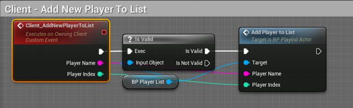

登出时销毁Actor并从PlayerList移除该Player

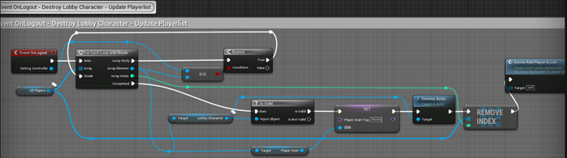

点击Kick时调用KickPlayer事件

开始游戏时加载LoadingScreen

#### Game

玩家加入Gamemode中的数组

 被Pause界面return to lobby按钮调用时travel到Lobby

游戏开始倒计时结束时调用Enable Character Movement My（暂无人调用）使玩家恢复正常行走状态

GameState：游戏倒计时

游戏倒计时声音，倒计时为零时调用上面函数

GameplayController：初始化变量倒计时不为零时生成人物

PlayerState：保存当前检测点和卡路里

## UI

BP_MainmenuActor: widget为WBP_MainMenu，Blend Mode为Transparent，在关卡运行开始时先自动每帧tick绘制，完成后转换为手动调用绘制

WBP_MainMenu：删除Map Info改变UI样式，改变Option为Tutorial

BP_LobbyActor：widget为WBP_Lobby，Blend Mode为Transparent，在关卡运行开始时先自动每帧tick绘制，完成后转换为手动调用绘制

WBP_Lobby：删除player list和Map Info改变UI样式，改变Option为Tutorial

BP_PlaylsitActor：widget为WBP_Playlist添加调用WBP_Playlist事件的接口，Blend Mode为Transparent（手动调用绘制）

WBP_MapButton：高亮选中的地图，点击后获取所有地图信息，取消其他被选中地图高亮效果并将被选中的地图添加高亮效果

 

HUD：每秒更新HUD上游戏进行时间，排名更新事件（SetRank）和卡路里更新事件（SetBMR），卡路里会由人物调用更新，排名会由路线排名系统（BP_Spline）更新

## 网络

## 参考

[剖析虚幻渲染体系-XR专题](https://www.cnblogs.com/timlly/p/16357850.html#152-xr%E6%8A%80%E6%9C%AF)
